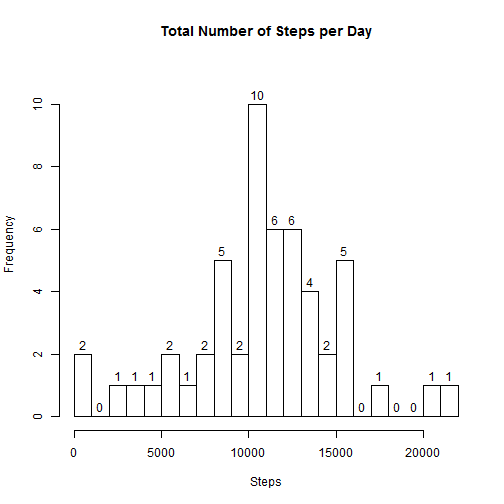
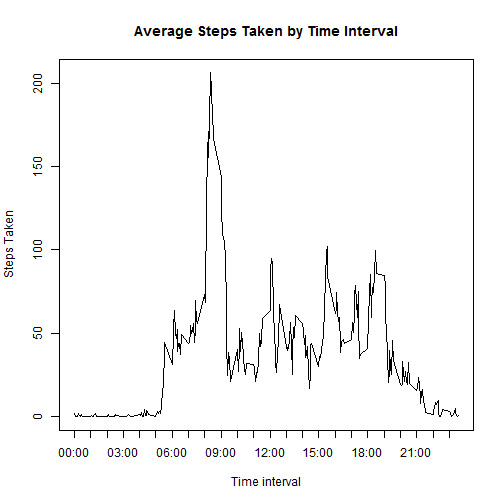
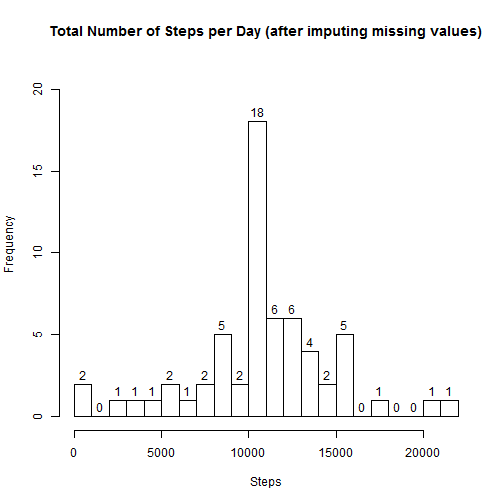
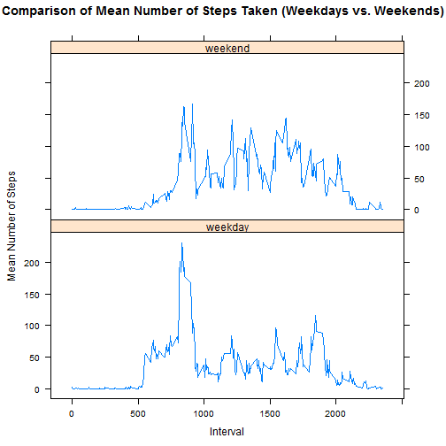

Reproducible Research Project 1 - June 15, 2014
===============================================

The data used below is from a personal activity monitoring device.  This device collects data at 5 minute intervals through out the day.  The data consists of two months of data from an anonymous individual collected during the months of October and November, 2012, and includes the number of steps taken in 5 minute intervals each day.

Load the activity data

```r
activity<-read.csv("activity.csv", colClasses = c("numeric", "Date", "numeric"))
```

Mean Steps
==========

Generate a histogram of the total number of steps taken each day:

```r
stepsPerDay<-aggregate(activity$steps, list(activity$date), sum)
hist(stepsPerDay$x, breaks=20, labels=TRUE, ylim=c(0,11), main="Total Number of Steps per Day", xlab="Steps", ylab="Frequency")
```

 

Calculate the mean and median number of steps taken per day
(NA values are excluded)

```r
##report of mean and median
mean(na.omit(stepsPerDay$x))
```

```
## [1] 10766
```

```r
median(na.omit(stepsPerDay$x))
```

```
## [1] 10765
```

Average Daily Activity Pattern
==============================

Plot of the 5-minute interval (x-axis) and the average number of steps taken (averaged across all day)


```r
intervalActivity<-na.omit(activity)
intervalActivity<-aggregate(intervalActivity$steps, list(intervalActivity$interval), mean)
colnames(intervalActivity)<-c("interval", "intervalSteps")

plot(intervalActivity$intervalSteps~intervalActivity$interval, type="l", xlab="Time interval", ylab="Steps Taken", main="Average Steps Taken by Time Interval", xaxt="n")

LGlabels<-c("00:00", "01:00", "02:00", "03:00", "04:00", "05:00", "06:00","07:00", "08:00","09:00", "10:00", "11:00", "12:00", "13:00", "14:00", "15:00", "16:00","17:00", "18:00","19:00", "20:00", "21:00", "22:00", "23:00")
axis(1,at=c(seq(0, 2300, by=100)), labels=LGlabels, tick=TRUE)
```

 

On average across all the days in the dataset, which 5-minute interval contains the maximum number of steps?

```r
intervalActivity[which.max(intervalActivity$intervalSteps),]
```

```
##     interval intervalSteps
## 104      835         206.2
```


Missing Values
==============

Calculate and report the toal number of missing values in the dataset 
(the total number of rows with NAs)

```r
sum(is.na(activity$steps))
```

```
## [1] 2304
```

To fill in the missing value of the dataset:

*1 - merge the dateframe with the raw activity data with the dataframe containing the mean number of steps for each interval across all days 
*2 - for each NA value, find the interval for that entry
*3 - check the mean value of steps for that 5-minute interval across all days
   
   4 - copy the mean value for that interval into the NA number of steps
   
The merged dataset (mergedDF) contains the merged data (with a new column for the interval mean) and the steps value has been updated so all NA values have been updated with the interval mean.
   

```r
mergedDF<-merge(activity, intervalActivity, by="interval")
mergedDF$steps<-as.numeric(apply(mergedDF, 1, function(row) {if (is.na(row[2])) row[4] else row[2]}))
```

Plot the total number of steps taken each day.

```r
newstepsPerDay<-aggregate(mergedDF$steps, list(mergedDF$date), sum)
hist(newstepsPerDay$x, breaks=20, labels=TRUE, ylim=c(0,21), main="Total Number of Steps per Day (after imputing missing values)", xlab="Steps", ylab="Frequency")
```

 

Mean and median total number of steps per day based upon a data with with NAs assigned based upon the mean for the interval.


```r
mean(newstepsPerDay$x)
```

```
## [1] 10766
```

```r
median(newstepsPerDay$x)
```

```
## [1] 10766
```

This mean is the same as the mean previously calculated previously since the mean for each time interval was used for previous NA values.

Weekday vs. Weekend Activity Comparison
=======================================


```r
mergedDF$daytype<-apply(mergedDF, 1, function(daycalc) {
  if (weekdays(as.Date(daycalc[3])) %in% c("Saturday","Sunday")) "weekend"     
  else "weekday"
})

activityByDaytype<-aggregate(mergedDF$steps, by=list(mergedDF$daytype, mergedDF$interval), mean)
colnames(activityByDaytype)<-c("daytype", "interval", "steps")

library(lattice)
xyplot(steps~interval | daytype, data=activityByDaytype, layout = c(1,2), type="l", main="Comparison of Mean Number of Steps Taken (Weekdays vs. Weekends)", xlab="Interval", ylab="Mean Number of Steps")
```

 


